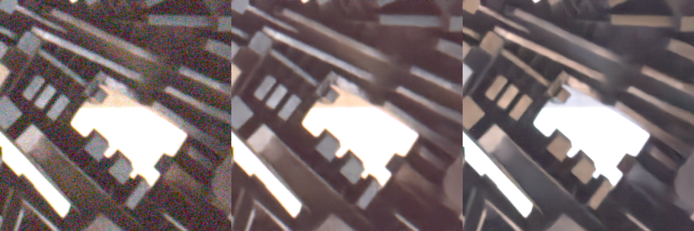
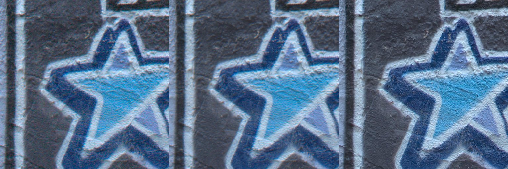
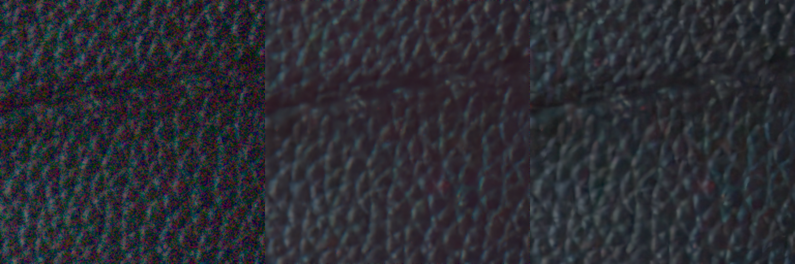

# Unprocessing Images for Learned Raw Denoising, CVPR'19 (Unofficial PyTorch Code)
Unofficial PyTorch implementation of the paper - Unprocessing Images for Learned Raw Denoising, CVPR'19, Tim Brooks, Ben Mildenhall, Tianfan Xue, Jiawen Chen, Dillon Sharlet, Jonathan T. Barron. 

This implementation is heavily borrowed from the offical Tensorflow code, which can be picked from [here](https://github.com/google-research/google-research/tree/master/unprocessing). 

Please ensure that you cite the paper if you use this code:
```
@inproceedings{brooks2019unprocessing,
  title={Unprocessing Images for Learned Raw Denoising},
  author={Brooks, Tim and Mildenhall, Ben and Xue, Tianfan and Chen, Jiawen and Sharlet, Dillon and Barron, Jonathan T},
  booktitle={IEEE Conference on Computer Vision and Pattern Recognition (CVPR)},
  year={2019},
}
```
### Requirements
The code is tested on Python 3.7, PyTorch 1.1.0, TorchVision 0.3.0, but lower versions are also likely to work. During training on a single NVidia GTX1080 GPU, keeping a batch-size of 16 and images cropped to 256x256, the memory consumption was found to be under 4Gb. 

### Training
In the paper, the authors use the [MIRFlickr](https://press.liacs.nl/mirflickr/) dataset for training. You can use the entire set of 1M images (as done in the paper) or simply take the smaller subset of 25k images which I did for my training process. I then divided the set into training and validation sets containing 23750 and 1250 images respectively. I then filtered out images with less than 256x256 resolution from the training set, effectively giving 23442 images for training. You may further downsample them as recommended [here](https://github.com/google-research/google-research/tree/master/unprocessing) and the paper. You can then run-
```
$ python train.py \
--model_dir <RUN-NAME> \
--train_dir <PATH-TO-MIRFlickr-TRAIN-DIR> \
--test_dir <PATH-TO-MIRFlickr-TRAIN-DIR>
```
### Testing
As done in the paper and recommended by the authors, the model works best on the [Darnstadt Noise Dataset](https://noise.visinf.tu-darmstadt.de/). You can test on this dataset by running-
```
$ python dnd_denoise.py \
--load_model <CHECKPOINT> \
--results_dir <RESULTS-DIR> \
--data_dir <PATH-TO-DND-DATASET>
```
You can download my pre-trained checkpoint from [here](https://www.dropbox.com/sh/y0ceokhvcpzqxsd/AACg2P3gryRL5VAnixeZ7QfLa?dl=0) for sample testing. Running the above script would denoise the input RAW images, and then save both the noisy and denoised sRGB images (i.e. after converting both the noisy and denoised RAW images to sRGB domain). 

### Results
Since, quntiative evaluation can only be done through official submission on the Darmstadt dataset webpage, I could only compare the results qualiatively. The results in the following order: Noisy RAW-to-sRGB patch, Denoised RAW-to-sRGB patch (this code), Denoised RAW-to-sRGB patch (from the paper's supplement [here](http://timothybrooks.com/tech/unprocessing/darmstadt-supp/))

Image: 0001_18


Image: 0006_06


Image: 0016_09


Image: 0017_03


While denoising quality is evident, there is some incorrect white balancing observed out for images following a different bayer pattern than RGGB (such as 0001_18). This is basically a visualization/RAW-to-sRGB processing problem in ```dnd_denoise.py```, and time perimitting, I may look into the problem. Also to note that the results are far from optimum, and some boost in performance can be obtained by training for a higher number of epochs or following some tricks mentioned by the authors on their official webpage [here](https://github.com/google-research/google-research/tree/master/unprocessing).   

Please feel free to report any improvements or bugs present in the code. 
